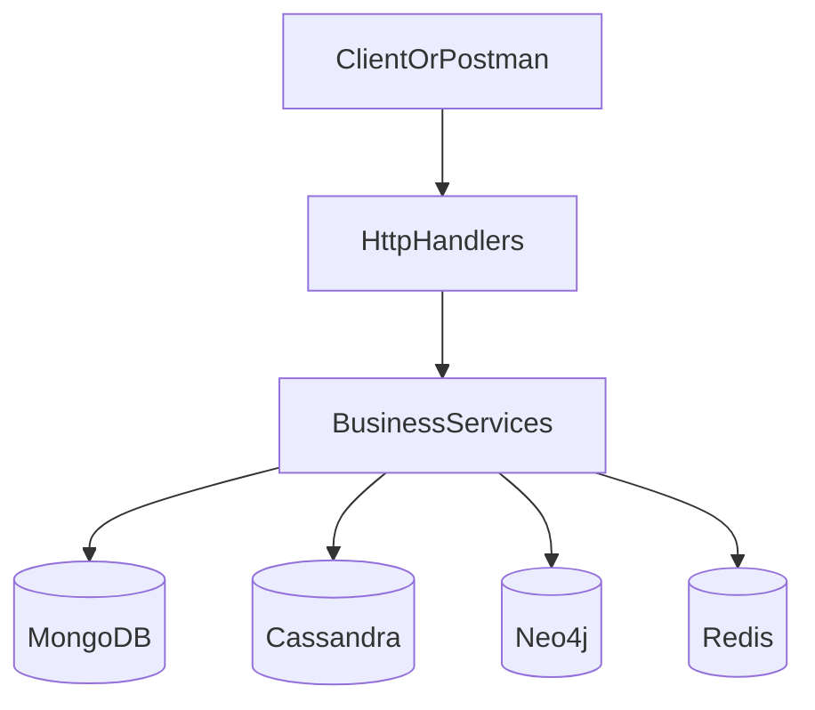

# EventHub: документация проекта

## 1) Архитектура и ответственность слоев

Проект построен как классическое многослойное backend-приложение:

- `internal/handler` — HTTP-слой (парсинг входных данных, валидация формата, статусы ответов, работа с cookie-сессией).
- `internal/service` — бизнес-логика, доменная валидация и orchestration между хранилищами.
- `internal/repository` — доступ к данным в конкретных NoSQL-системах.
- `cmd/app/main.go` — composition root: инициализация клиентов, репозиториев, сервисов, роутов и graceful shutdown.

Поток запроса:

1. Клиент вызывает HTTP endpoint.
2. Handler проверяет/обновляет сессию, валидирует вход.
3. Service выполняет бизнес-логику и вызывает нужные repository.
4. Repository читает/пишет в MongoDB/Cassandra/Neo4j/Redis.
5. Handler возвращает итоговый HTTP-ответ.



## 2) Карта хранилищ NoSQL

### MongoDB (основные сущности)

Используется для главных бизнес-сущностей:

- `users` (репозиторий `MongoUserRepository`)
  - уникальный индекс по `username`.
- `events` (репозиторий `MongoEventRepository`)
  - фильтрация и листинг по `title`, `category`, `price`, `location.city`, `started_at`, `created_by`;
  - поддержка patch-обновлений полей организатором.

### Cassandra (реакции и отзывы)

Используется для высокочастотных append/update сценариев:

- таблица реакций `event_reactions` (`CassandraEventReactionRepository`)
  - хранит like/dislike по паре `(event_id, user_id)`;
  - агрегация счётчиков по событию.
- таблица отзывов `event_reviews` (`CassandraEventReviewRepository`)
  - хранит review пользователя по событию;
  - поддерживает create/list/update и агрегацию количества/суммы рейтингов.

### Neo4j (граф рекомендаций)

Используется для коллаборативных рекомендаций:

- узлы `User`, `Event`;
- ребро `LIKED`;
- выбор кандидатов в рекомендациях для `/recommendations` через `ListRecommendedEventIDs`.

### Redis (кеши и сессии)

Используется как быстрый кэш и session store:

- сессии: `internal/session/RedisStore`;
- кэш реакций по title: `event:{md5(title)}:reactions`;
- кэш отзывов по title: `event:{md5(title)}:reviews`;
- кэш рекомендаций пользователя: `user:{userID}:recomms`.

TTL задаются через переменные окружения и применяются при записи в кэш.

## 3) HTTP API: текущие маршруты

Маршруты регистрируются в `cmd/app/main.go`.

### Системные

- `GET /health`
- `GET /swagger/`

### Сессии и авторизация

- `POST /session`
- `POST /auth/login`
- `POST /auth/logout`

### Пользователи

- `POST /users`
- `GET /users`
- `GET /users/{id}`
- `GET /users/{id}/events`

### События и социальные действия

- `POST /events`
- `GET /events`
- `GET /events/{id}`
- `PATCH /events/{id}`
- `GET /recommendations`
- `POST /events/{id}/like`
- `POST /events/{id}/dislike`
- `POST /events/{id}/reviews`
- `GET /events/{id}/reviews`
- `PATCH /events/{id}/reviews/{review_id}`

## 4) Взаимодействие с проектом через Makefile

`Makefile` — основной и рекомендуемый entrypoint для локальной разработки.

### Быстрый старт

1. Заполните `.env.local` (хосты, порты, логины/пароли и TTL).
2. Запустите сервисы:

```bash
make run
```

Команда поднимает Docker Compose окружение в фоне с пересборкой.

### Основные команды

- `make run` — запуск в detached-режиме.
- `make rund` — запуск в foreground (удобно для отладки).
- `make services` — статус контейнеров.
- `make stop` — корректная остановка окружения.
- `make clean` — остановка + удаление томов.

Рекомендованный daily-flow:

1. `make run`
2. `make services`
3. проверка API (Postman/Swagger)
4. `make stop` (или `make clean`, если нужна полная очистка данных)

## 5) Postman-коллекция

Файл коллекции: `api/eventhub.postman_collection.json`.

На текущий момент в коллекции описан базовый smoke-check:

- folder `Health`
- request `GET {{base_url}}/health`

### Как использовать

1. Откройте Postman.
2. Импортируйте файл `api/eventhub.postman_collection.json`.
3. Проверьте переменную `base_url` (по умолчанию `http://localhost:8080`).
4. Выполните `Healthcheck`.

Рекомендуемый порядок запуска:

Session -> Create or Refresh Session
Users -> Register User или Auth -> Login
Events -> Create Event
дальше реакции/отзывы/рекомендации.

### Как расширять коллекцию

Рекомендуется добавлять в коллекцию все публичные endpoint'ы проекта.
Для каждого запроса полезно добавлять:

- пример request body;
- пример response body для успешного сценария;
- примеры ошибок (`400/401/404/409`) для регрессионных проверок.
