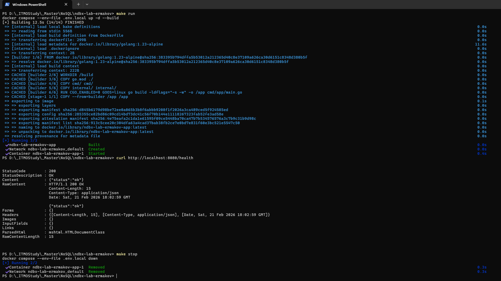

## ЛР 1, Ермаков Тимофей, группа P4135

### Инструменты

- Go 1.23
- Docker, Docker Compose
- Make

### Работа

Запуск на порту, указанном в .env.local:

```bash
make run
```

Проверка:

```bash
curl http://localhost:8080/health
# {"status":"ok"}
```

Остановка:

```bash
make stop
```

## Конфигурация .env.local

| Переменная | Описание          | Значение по умолчанию |
| ---------- | ----------------- | --------------------- |
|  APP_HOST  | Хост HTTP-сервера | 0.0.0.0               |
|  APP_PORT  | Порт HTTP-сервера | 8080                  |

## API

### GET /health

Проверка доступности сервиса.

**Ответ:** 200 OK

```json
{
  "status": "ok"
}
```

